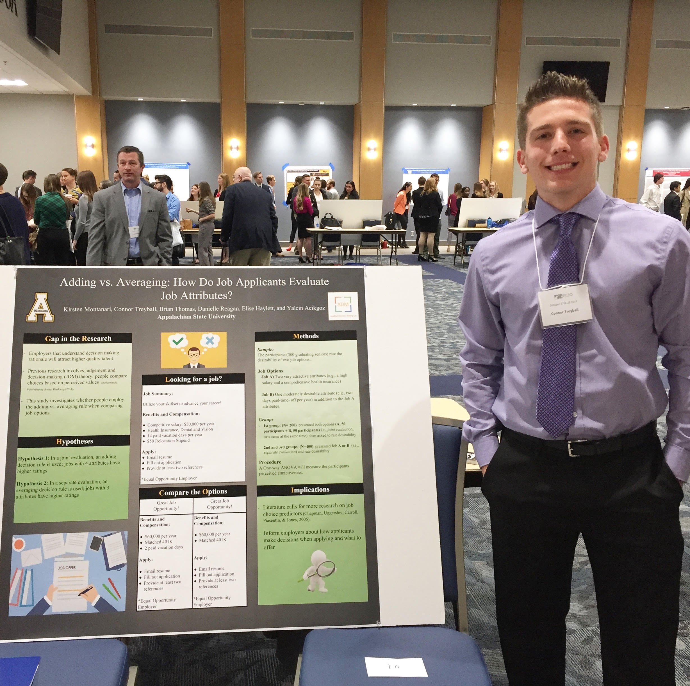

##**My Research!**

This section is dedicated to my current research as a student of the Appalachian State Psychology department. The main focus of my study is applicant decision making. My team consists of five people and our research professor. The purpose of our current study is understanding what evaluation methods participants use when presented different job constructs. There are ultimately two methods that people use: joint and separate. Our study is still in progress and we have yet to collect data. However, we're currently in the process of designing our survey and we'll collect data soon after. This is quite obvious but I want to reaffirm that without the help of my professor Yalcin Acikgoz and fellow students (Caitlyn Nearhood, Elise Haylett, Jarod Fyler, and Daniel Sumner) the success in our current research would be significantly different. I'd also like to mention the researchers who have assisted in beginning the study: Kirsten Montanari, Danielle Reagan, and Brian Thomas. 

**This is our proposal for the RCIO conference at The University of Tennessee at Chattanooga**
<iframe src="./ADM.pdf" width="100%" height="700px">

</iframe>

**This is our ADM research poster presented for the RCIO conference at UTCC**
<figure align = "middle">
